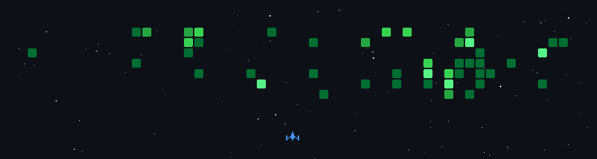

# Hi there, I'm Bhavya Pandya 👋🏻

Also with the magic of no-code & AI, I craft digital melodies that users not only love but also waltz with joy!

 

 

🚀 **Currently:** Helping organizations create MVPs in 30 days with [Enfiq](https://www.enfiq.com/). 

📊 **Building:** Martech Product [Phi Variate](https://furlough.com/vision/variate/).

🧠 **Focus:** Falling into the void of knowledge across coding, design, AI orchestration, and no-code tools.

📫 **Reach me at:** [Google Meet Link](https://cal.com/bhavyapandya/30m)

> *"A wise man once told me, that your network is your networth."*

 

## 🛠️ Top Selected Work & Projects

❏ **[TartanHQ](https://tartanhq.com)** — AI-Powered Enterprise Automation. *(Figma, Framer & On-page SEO)*

❏ **[Toasty Design](https://toastydesign.com)** — Web Design and Branding for Startups. *(Framer, On-page, GTM & GA)*

❏ **[Timelinx](https://producthunt.com/timelinx)** — Syncing Moments Across Timezones. A Discord bot built with Claude and Python.

❏ **[F1 Technology to Road Cars Innovation](https://zenodo.org)** — A published research paper exploring the bridge between track engineering and everyday vehicles.

❏ **[Domain Comp](#)** *(Coming Soon)* — Smart Domain Price Comparison Tool. *(Anti-Gravity, React, Vercel, GTM, GA & Microsoft Clarity)*

 

## 💻 The Tools Behind The Build

#### Code & Backend

           

#### AI & Intelligent Agents

     

#### Marketing, SEO & Analytics

     

#### Management & Collaboration

   

#### Design & No-Code

  

#### Workflow Automations

 

 

## 🌟 Beyond The Digital Space
When I'm not building platforms or collaborating with industry rockstars, you can usually find me:
* 🏁 Cheering on the grid during Formula 1 weekends.
* ⛩️ Catching up on anime and manga.
* 🐾 Hanging out with my cats, Mr. Pawchito and Mrs. Pipsy.

 

<h2>🤝 The Community Hubs</h2> 

<table>
  <tr> 
    <th>Community</th> 
    <th>Members</th> 
    <th>Link</th>
  </tr>
  <tr> 
    <td>&nbsp; Furlough (Server Partnered)</td> 
    <td>50.01k+</td> 
    <td><a href="https://discord.gg/GkpcnhyFnT" target="_blank">Join Server</a></td>
  </tr>
  <tr> 
    <td>&nbsp; SEO Content AI (Server Managed)</td> 
    <td>4.86k+</td> 
    <td><a href="https://discord.gg/uPrvj5R3gm" target="_blank">Join Server</a></td>
  </tr>
  <tr> 
    <td>&nbsp; Content Match (Server Managed)</td> 
    <td>2.96k+</td> 
    <td><a href="https://discord.gg/ewredrk43W" target="_blank">Join Server</a></td>
  </tr>
  <tr> 
    <td>&nbsp; Critic Design (Server Managed)</td> 
    <td>1.82k+</td> 
    <td><a href="https://discord.gg/qGNpUVUdcp" target="_blank">Join Server</a></td>
  </tr>
  <tr> 
    <td>&nbsp; Crito Design (Server Managed)</td> 
    <td>310+</td> 
    <td><a href="https://discord.gg/NhkjCEAuPP" target="_blank">Join Server</a></td>
  </tr>
  <tr> 
    <td>&nbsp; Vibrato (Server Setup)</td> 
    <td>275+</td> 
    <td><a href="https://discord.gg/arrsbjYnF6" target="_blank">Join Server</a></td>
  </tr>
  <tr> 
    <td>&nbsp; Warriors Matrix (Server Owner)</td> 
    <td>270+</td> 
    <td><a href="https://discord.gg/2CAx5qWXzS" target="_blank">Join Server</a></td>
  </tr>
  <tr> 
    <td>&nbsp; Mission Ready Networking (Server Setup)</td> 
    <td>50+</td> 
    <td><a href="https://discord.gg/a6K7PDePzC" target="_blank">Join Server</a></td>
  </tr>
</table>

 

#### 🌐 Want to get in touch?

#### 🎮 Let's Play some Games together

 

 

## 🔫 Live footage of me fighting bugs at 2 AM:

